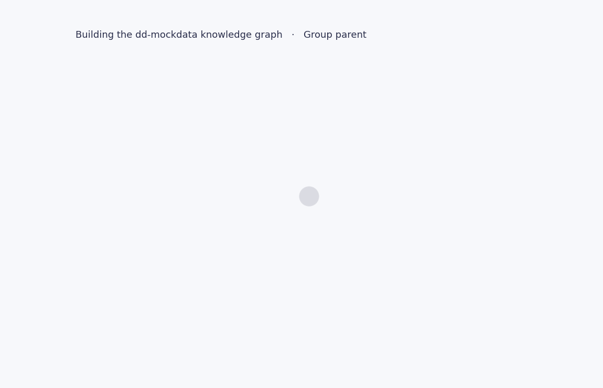

# dd-mockdata-kg

Knowledge-graph extraction & evaluation harness for the
[**dd-mockdata**](https://github.com/Tonvenio/dd-mockdata) German
legal-due-diligence corpus.

Turns 6,265 fictional DD documents (DOCX/XLSX/PDF) into a structured Knowledge Graph of
companies, subsidiaries, persons, roles, contracts, patents, financial covenants,
M&A targets, pension plans, and the relationships between them — emittable as
**Turtle (RDF/OWL)**, **JSON-LD** and **Neo4j Cypher**.



<sub>A slice of the gold Knowledge Graph for *Brennhagen Elektronik AG*, built up entity tier by tier (install the helpers with `pip install -e ".[viz]"`, then regenerate with `python scripts/viz_animation.py`).</sub>

This repository is the **gold Knowledge-Graph companion** to dd-mockdata. It includes:

| | |
|---|---|
| `schema/` | The OWL/RDFS ontology + SHACL shapes |
| `ddkg/extractors/` | Six rule-based extractors (LLM-hybrid planned for v0.3) |
| `ddkg/builders/` | Triples → Turtle / JSON-LD / Cypher serializers |
| `scripts/` | Visualisation helpers (subgraph PNG, interactive HTML, build GIF) |
| `ddkg/eval/` | RAG / IE / contradiction-detection evaluation harness |
| `kg/` | Pre-built gold Knowledge Graph (run `python -m ddkg build` to regenerate) |
| `examples/` | Notebooks / scripts demonstrating typical use |

Licensed **MIT** for code ([LICENSE](LICENSE)) and **CC-BY-4.0** for the
generated Knowledge-Graph outputs and visual assets ([LICENSE-DATA](LICENSE-DATA)).
The outputs are a derivative of the CC-BY-4.0
[dd-mockdata](https://github.com/Tonvenio/dd-mockdata) corpus, so sharing them
requires attributing **both** this project and dd-mockdata.

> **For research and educational use.** This project — like the underlying
> [dd-mockdata](https://github.com/Tonvenio/dd-mockdata) corpus — exists to support
> research and teaching: benchmarking knowledge-graph extraction, RAG and
> due-diligence tooling on a fully **synthetic** dataset. Every company, person,
> contract, financial figure and identifier is fictional; real organisation names
> appear only as fictional counterparties. It is **not** legal, financial or
> investment advice and must not be used to make decisions about real people or
> organisations.

## Quickstart

```bash
# 1) Clone the dataset (this repo depends on it)
git clone https://github.com/Tonvenio/dd-mockdata.git ../dd-mockdata

# 2) Clone & install this repo
git clone https://github.com/Tonvenio/dd-mockdata-knowledge-graph.git
cd dd-mockdata-knowledge-graph
pip install -e .

# 3) Build the knowledge graph
python -m ddkg build --corpus ../dd-mockdata --out kg/

# Outputs in kg/:
#   gold.ttl       — Turtle (RDF)
#   gold.jsonld    — JSON-LD
#   gold.cypher    — Neo4j Cypher (MERGE statements)

# 4) Run evaluation
python -m ddkg eval --kg kg/gold.ttl --suite ie
```

## Querying the graph in Neo4j (Cypher)

`ddkg build` also writes `kg/gold.cypher`, a Neo4j-ready dump. Load it into a
local Neo4j and explore the graph visually:

```bash
# start a throwaway Neo4j (Docker)
docker run -d --name ddkg-neo4j -p 7474:7474 -p 7687:7687 \
  -e NEO4J_AUTH=neo4j/password neo4j:latest

# wait ~30s for it to come online, then load the dump
docker exec -i ddkg-neo4j cypher-shell -u neo4j -p password < kg/gold.cypher

# open the Browser at http://localhost:7474  (user: neo4j · pass: password)
```

The dump faithfully mirrors the ontology — one Neo4j **label** per class and a
readable relationship type per predicate. Every node carries `uri` and `label`.

**Node labels** — `Company` `Subsidiary` `Counterparty` `Person` `Position`
`Role` `Patent` `Product` `EmploymentContract` `SupplyContract` `LeaseContract`
`NDA` `LoanFacility` `Covenant` `CovenantObservation` `BoardMeeting`
`ShareholderMeeting` `ReviewEvent` `DocumentReference`

**Relationships** — `PARENT_COMPANY` `HOLDS_POSITION` `POSITION_AT`
`POSITION_ROLE` `HAS_COUNTERPARTY` `PARTY_TO` `INVENTED_BY` `ASSIGNED_TO`
`RELATES_TO` `MANUFACTURED_BY` `GOVERNED_BY` `OBSERVATION_OF` `EVENT_OF`
`DOCUMENT_OF`

```cypher
// 0) See the data model itself (the meta-graph)
CALL db.schema.visualization();

// 1) The holding and its subsidiaries
MATCH (sub:Subsidiary)-[:PARENT_COMPANY]->(holding:Company)
RETURN holding, sub;

// 2) A patent → its inventors and the product it covers
MATCH (p:Patent)-[:INVENTED_BY]->(person:Person),
      (p)-[:RELATES_TO]->(prod:Product)
RETURN p, person, prod;

// 3) Loan facility → covenants → quarterly observations
MATCH path = (:LoanFacility)-[:GOVERNED_BY]->(:Covenant)
             <-[:OBSERVATION_OF]-(:CovenantObservation)
RETURN path;

// 4) Top counterparties by number of contracts
MATCH (c:Counterparty)<-[:HAS_COUNTERPARTY]-(contract)
RETURN c.label, count(contract) AS contracts
ORDER BY contracts DESC LIMIT 10;

// 5) Employment contracts by start date
MATCH (c:EmploymentContract) WHERE c.effectiveDate IS NOT NULL
RETURN c.label, c.effectiveDate ORDER BY c.effectiveDate;
```

Returning **nodes / paths** draws the graph; returning **`.properties`** gives a
table. Star a query (⭐) to save it as a reusable view, and click a label chip in
the result legend to set captions, colours and sizes.

> The default Bolt port is `7687`. If it's already taken, map another (e.g.
> `-p 7690:7687`) and set `-e NEO4J_server_bolt_advertised__address=localhost:7690`
> so the Browser connects to the right port. Note: the Neo4j Browser's WebSocket
> connection is blocked by recent Safari versions — use Chrome or Firefox.

## What's in the Knowledge Graph

For each of the three companies in dd-mockdata
(`mueller_small`, `biotech_medium`, `roehrig_large`):

- **Organisations** — parent company + subsidiaries + counterparties (OEMs,
  banks, auditors, law firms) with HRB / WKN / ISIN.
- **Persons** — Vorstand, Aufsichtsrat, Geschäftsführung, Prokuristen,
  Werkleiter, KAMs — with roles, appointment dates, optional departure dates.
- **Contracts** — Anstellungs-, Rahmen-Liefer-, Konsortialkredit-, M&A-, NDA-,
  Pensions-, Mietverträge — with parties, signing dates, volumes.
- **Patents** — number, jurisdiction, inventors, lizenz status.
- **Financial covenants** — net-debt-to-EBITDA, ICR, equity ratio,
  with quarterly observations.
- **Cross-references** — every entity / relation carries a `provenance` link
  back to the source document (`mueller_small/01_…/X.docx#para12`).

## Schema overview

See `schema/ontology.md` for the full schema; canonical namespaces:

```
@prefix dd:    <https://w3id.org/dd-mockdata#> .
@prefix org:   <http://www.w3.org/ns/org#> .
@prefix foaf:  <http://xmlns.com/foaf/0.1/> .
@prefix prov:  <http://www.w3.org/ns/prov#> .
@prefix time:  <http://www.w3.org/2006/time#> .
@prefix schema:<https://schema.org/> .
```

The core classes (`dd:Company`, `dd:Person`, `dd:Position`, `dd:Contract`,
`dd:Patent`, `dd:Covenant`, `dd:ICTransaction`) reuse W3C
[org](https://www.w3.org/TR/vocab-org/),
[FOAF](http://xmlns.com/foaf/0.1/),
[PROV-O](https://www.w3.org/TR/prov-o/) and
[schema.org](https://schema.org/) wherever possible, and define
domain-specific subclasses + properties only where standards don't fit.

## Extractor pipeline

```
dd-mockdata corpus
        │
        ├── ddkg.extractors.canonical   # ground-truth facts from enhance_lib.py (conf 1.0)
        ├── ddkg.extractors.filename    # doc index + employment / patent / event entities
        ├── ddkg.extractors.contracts   # dates / volumes / counterparties from contract DOCX
        ├── ddkg.extractors.patents     # filing #, jurisdiction, inventors from Patentschriften
        ├── ddkg.extractors.covenants   # Covenant + quarterly CovenantObservation from tables
        └── ddkg.extractors.positions   # appointment dates + dated board / HV events
        │
        ▼
  ddkg.pipeline.Deduper          # (s,p,o) de-dup; canonical wins functional conflicts
        │
        ▼
  ddkg.builders.*    →  kg/gold.{ttl,jsonld,cypher}
```

The `canonical` extractor is **always run first** (every triple it emits is
derived directly from `enhance_lib.py` constants — it can never hallucinate, so
it wins any conflict). The five document-level extractors then enrich that seed
with file-specific facts. They are pure rule-based parsers — there is no LLM in
the pipeline yet; an optional `llm_hybrid` pass is planned for v0.3 (see
`ROADMAP.md`). Each extractor is one self-contained file under
`ddkg/extractors/` with a focused test in `tests/`.

## Evaluation suites

```bash
python -m ddkg eval --kg kg/gold.ttl --suite ie
python -m ddkg eval --kg kg/gold.ttl --suite rag --questions ddkg/eval/q_de.json
python -m ddkg eval --kg kg/gold.ttl --suite contradiction
```

- **`ie`** — Information Extraction. Tests precision/recall of extractor passes
  vs. the canonical gold Knowledge Graph on a held-out 10 % of documents.
- **`rag`** — Retrieval-Augmented Generation. Runs a set of German DD questions
  (e.g. *»Liste alle Mitglieder des Aufsichtsrats der Brennhagen Elektronik AG
  einschließlich Bestellungsdatum und Ausschuss-Mitgliedschaften«*) and scores
  whether a retrieval system returns the documents that *would* let an LLM
  answer correctly.
- **`contradiction`** — Cross-document consistency. Verifies the Knowledge Graph has no
  conflicting facts (e.g. two different birthdays for one person, two
  different end-dates for one contract).

## Citation

```bibtex
@misc{ohrendorf2026ddmockdatakg,
  author    = {Ohrendorf, Marc},
  title     = {{dd-mockdata-kg}: Knowledge-Graph Companion for the
               dd-mockdata German Due-Diligence Corpus},
  year      = {2026},
  version   = {0.1.0},
  publisher = {GitHub},
  url       = {https://github.com/Tonvenio/dd-mockdata-knowledge-graph}
}
```

## Status

**v0.2 — document-level extractors.** All six rule-based extractors are
implemented (canonical + filename + contracts + patents + covenants +
positions). A full build over the corpus yields **~30,300 triples**
(≈6,250 nodes), including 210 employment contracts, 69 supply contracts,
33 patents, 3 covenants with 24 quarterly observations, and a 5,300-document
provenance index. Quality gates on every build:

- `ddkg eval --suite ie` — **28/28** information-extraction probes pass
- `ddkg eval --suite contradiction` — **0** cross-document contradictions
- `pytest` — 31 passing tests (incl. an end-to-end SHACL validity check)
- `pyshacl -s schema/shapes.ttl -e schema/ontology.ttl -d kg/gold.ttl` — conforms

Next up (v0.3): an optional LLM-hybrid pass for the hard cases. See `ROADMAP.md`.

## Contributing

The single most useful contribution at this stage is **additional rule-based
extractors** that bring the per-folder extraction precision/recall on the
held-out IE suite into the high-90s. Each extractor lives in a single file
under `ddkg/extractors/` and is exercised by a focused test in `tests/`.

## Related

- [dd-mockdata](https://github.com/Tonvenio/dd-mockdata) — the corpus.
- [W3C ORG vocabulary](https://www.w3.org/TR/vocab-org/) — organisational
  structure ontology reused here.
- [PROV-O](https://www.w3.org/TR/prov-o/) — provenance vocabulary used to
  link every triple back to a source document.
